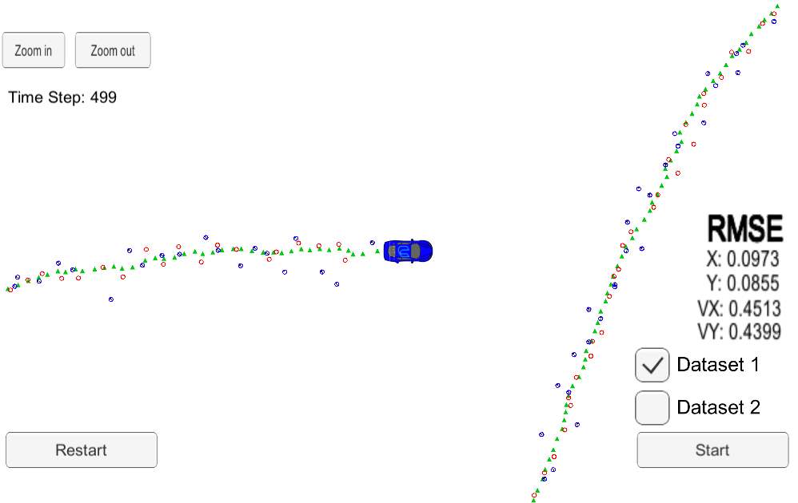
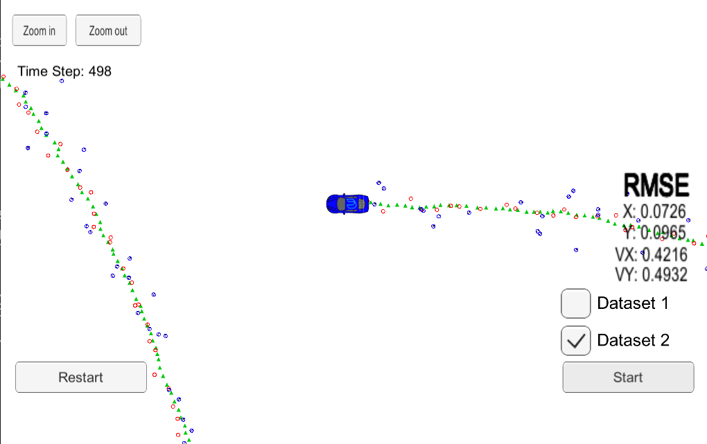

# Extended Kalman Filter Project

## Overview

This project utilizes a kalman filter to estimate the state of a moving object of interest with noisy lidar and radar measurements. This project used simulated lidar and radar measurements detecting a bicycle that travels around with a vehicle. The simulator can be downloaded [here](https://github.com/udacity/self-driving-car-sim/releases). 

This project uses a Kalman filter, an extended kalman filter, lidar measurmements, and radar measurements to track the bicycle's position and velocity.

The goal of this project was to have x, y, vx, vy output coordinates with a Root Mean Square Error (RMSE) <= [.11, .11, 0.52, 0.52] when using the file: "obj_pose-laser-radar-synthetic-input.txt" which is the same data file the simulator uses for Dataset 1.

Lidar measurements are red circles, radar measurements are blue circles with an arrow pointing in the direction of the observed angle, and estimation markers are green triangles. The video below shows what the simulator looks like when a c++ script is using its Kalman filter to track the object. The simulator provides the script the measured data (either lidar or radar), and the script feeds back the measured estimation marker, and RMSE values from its Kalman filter.

## Setup
This repository includes two files that can be used to set up and install [uWebSocketIO](https://github.com/uWebSockets/uWebSockets) for either Linux or Mac systems. For windows you can use either Docker, VMware, or even [Windows 10 Bash on Ubuntu](https://www.howtogeek.com/249966/how-to-install-and-use-the-linux-bash-shell-on-windows-10/) to install uWebSocketIO. 

Once the install for uWebSocketIO is complete, the main program can be built and run by doing the following from the project top directory.

1. mkdir build
2. cd build
3. cmake ..
4. make
5. ./ExtendedKF

Here is the main protocol that main.cpp uses for uWebSocketIO in communicating with the simulator.

**INPUT**: values provided by the simulator to the c++ program

["sensor_measurement"] => the measurement that the simulator observed (either lidar or radar)

**OUTPUT**: values provided by the c++ program to the simulator

["estimate_x"] <= kalman filter estimated position x

["estimate_y"] <= kalman filter estimated position y

["rmse_x"]

["rmse_y"]

["rmse_vx"]

["rmse_vy"]

---

## Project Results

The sensor f

Both datasets were tested with the extended kalman filter project - the difference between the datasets include the direction the car is moving and the order the measurments are stored (Radar vs Lasar). On Each dataset it was seen that the sensor fusion algorithm produced an RMSE < [.11, .11, 0.52, 0.52], thus succeeding in the project goals. The images below show the RMSE from the simulator at the end of the simulation.

